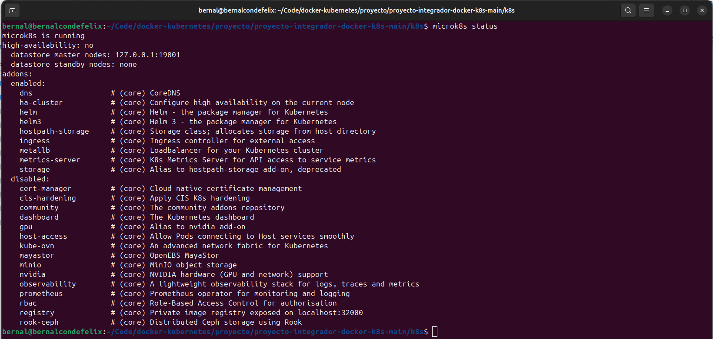
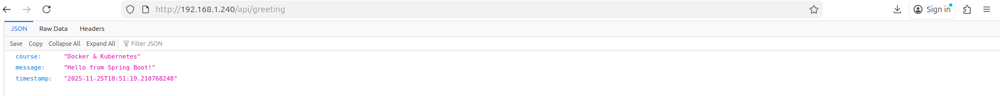
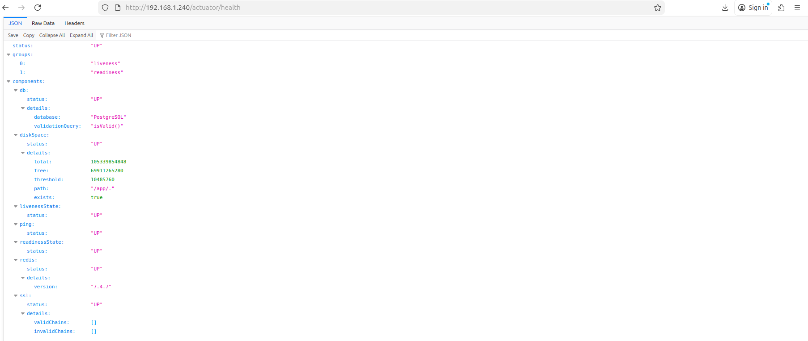
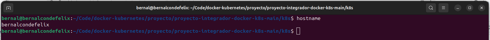
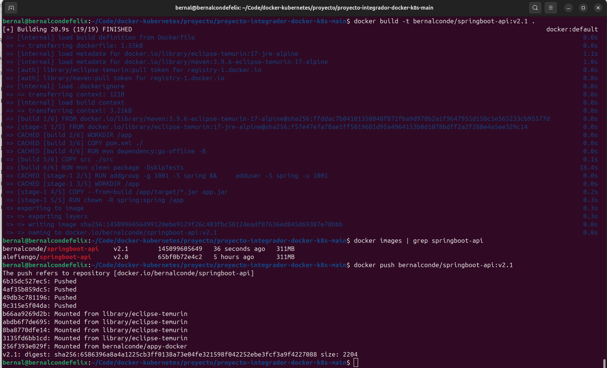
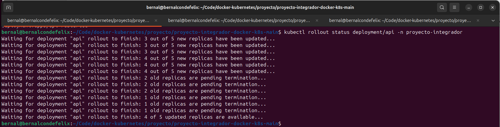
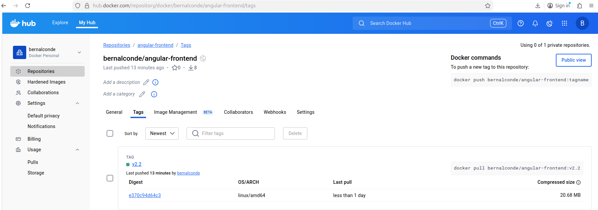
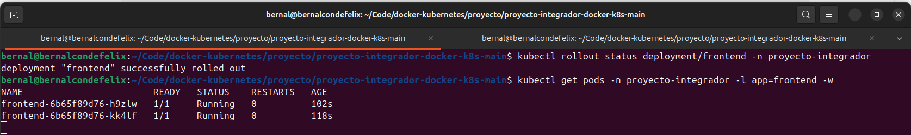
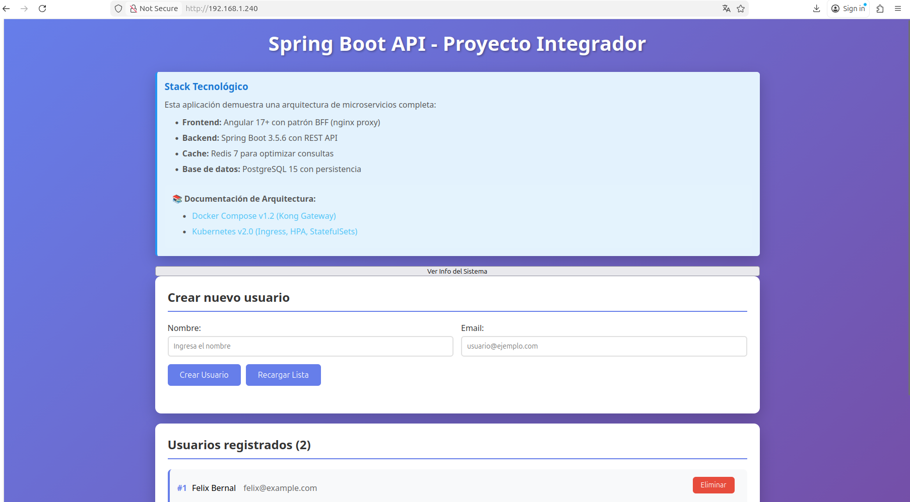
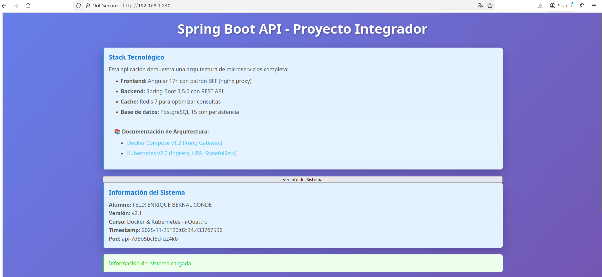

# Proyecto Final - Docker & Kubernetes

**Alumno:** Felix Enrique Bernal Conde
**Fecha:** 25/11/2025
**Curso:** Docker & Kubernetes - i-Quattro

## Links de Docker Hub
- Backend v2.1: https://hub.docker.com/repository/docker/bernalconde/springboot-api/tags
- Frontend v2.2: https://hub.docker.com/repository/docker/bernalconde/angular-frontend/tags

## Parte 1: Setup del Ambiente

**Ambiente utilizado:**
- [VirtualBox]
- Nombre de VM/Instancia: bernalcondefelix
- Sistema operativo: Ubuntu 24.04 LTS
- Recursos: 4GB RAM, 2 CPU cores
- Red configurada: Bridge
- Rango MetalLB: 192.168.1.240-192.168.1.250

### Screenshots
*microk8s instalado con addons habilitados*

*Proyecto v2.0 funcionando en el cluster*

*frontend Angular*

*JSON con el saludo*

*lista de usuarios*

*Heatlh*

*Hostname*


## Parte 2: Backend v2.1
Ademas del codigo proporcionado tambien se hizo la importacion de la libreria
```bash
import org.springframework.http.ResponseEntity;
```

### Código Agregado
```bash
@GetMapping("/api/info")
public ResponseEntity<Map<String, Object>> getInfo() {
    Map<String, Object> info = new HashMap<>();
    info.put("alumno", "FELIX ENRIQUE BERNAL CONDE");
    info.put("version", "v2.1");
    info.put("curso", "Docker & Kubernetes - i-Quattro");
    info.put("timestamp", LocalDateTime.now().toString());
    info.put("hostname", System.getenv("HOSTNAME"));
    return ResponseEntity.ok(info);
}
```

### Screenshots
*Código del endpoint agregado*

*docker images*

*Docker Hub*

*kubectl rollout status durante la actualización*


*kubectl get pods*

*output*


**Nota:** Se presento un error durante el rollout debido a una mala configuracion en la adicion de un nuevo endpoint, se adiciono el nuevo endpoint a la misma ruta. Una vez corregido el error se procedio a repetir el ciclo de construcion y despliegue.

## Parte 3: Frontend v2.2
Se procedio con la adicion de un boton que permite desplegar informacion del sistema.

### Screenshots
*appcomponent.html*

*appcomponent.ts*

*Docker Hub*

*kubectl get pods*

*botón "Ver Info del Sistema"*

*información*


## Parte 4: Gestión de Versiones

### ¿Qué hace kubectl rollout undo?
Permite la vuelta atras teniendo como puntos de referencias cada deploy realizado con exito.

## Parte 5: Ingress + MetalLB

**IP del Ingress:** [192.168.1.240]

### Screenshots
*MetalLB*

*frontend*

*curl a /api/users y /api/greeting*

*curl a /api/info*

*curl a /actuator/health*


## Conclusiones
Se logro realizar de manera satisfactoria las tareas planteas en el desarrollo del proyecto, si bien se presentaron dificultades estas fueron subsanadas en su mayoria. Se observo que el uso de docker efectivamente reduce el uso de recursos. Se pudo entender que a pesar de su sencilles es posible desplegar sistemas complejos que se comunican entre si permitiendonos tambien el control de versiones (despliegue y reversion).


### Aprendizajes principales
- [Punto 1] Se aprendio las configuraciones basicas para desplegar un entorno distribuido (backend - frontend), asi como la instalacion y habilitacion de las herramientas necesarias.
- [Punto 2] Se observo la sencilles con la que se puede agregar endpoints a las aplicaciones.
- [Punto 3] De igual manera se pudo ver como configurar el frondend.
- [Punto 4] En mi opinion el punto mas importante del proyecto realizado, pues si bien docker te permite guardar distintas versiones de una imagen tambien es posible guardar imagenes corruptas, por lo cual una vuelta atras no es posible.
- [Punto 5] Se observo como es posible comunicar la aplicacion hacia el exterior.

### Dificultades encontradas
- [Dificultad 1 y cómo la resolviste] La mayor dificultad presente fue el manejo del metalLB pues se tenia o no la ip externa, esto no pudo ser solucionado, hubo momentos en los que la ip era asignada y otros en las que no respondia teniendo que utilizar el localhost para la mayoria de las pruebas.
- [Dificultad 2 y cómo la resolviste] Otra dificultad fue el manejo de versiones, pues debido a una mala configuracion se subio una imagen corrupta a docker ya no teniendo la posibilidad de hacer una vuelta atras. No se encontro solucion a esta dificultad y se inicio el proyecto de cero teniendo cuidado en revisar las configuraciones.

### Reflexión
[¿Cómo aplicarías esto en un proyecto real?]
Docker resulto se muy practico puediendo ser utilizado para proyecto sencillos como una pagina web de informacion hasta en sectores mas complejos como sistemas de compras a gran escala. En lo personal lo emplearia para proyectos como un sistema de inventario, pues el proyecto realizo es una buena base para empezar.
